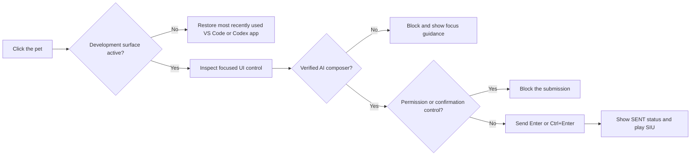

<p align="center">
  
</p>

<h1 align="center">VS Code Pet</h1>

<p align="center">
  <strong>A Ronaldo-inspired animated control surface for Claude Code, VS Code Codex, and the Codex desktop experience.</strong>
</p>

<p align="center">
  Five fan-art eras, expressive low-frame animation, system-aware celebrations, and a guarded one-click AI prompt bridge across VS Code and the Windows Codex app — all running locally.
</p>

<p align="center">
  
  
  
  
  
  
</p>

---

## The character, across five eras

<table align="center">
  <tr>
    <td align="center"><br><strong>Purple Noodle</strong></td>
    <td align="center"><br><strong>Young Ronaldo</strong></td>
    <td align="center"><br><strong>Juventus Half &amp; Half</strong></td>
    <td align="center"><br><strong>Portugal Euro Red</strong></td>
    <td align="center"><br><strong>White &amp; Gold</strong></td>
  </tr>
</table>

Press global **7** or **Numpad 7** to move between all five skins. Every era has its own hair, face, kit, color treatment, and the same complete 25-frame motion system.

## Experience at a glance

| Interaction | Result |
| --- | --- |
| **Single-click with a verified AI composer focused** | Submit in Claude Code, VS Code Codex, or Codex desktop and play Point → Ground → SIU |
| **Single-click while another app is active** | Restore the most recently used VS Code or Codex desktop window without submitting anything |
| **Single-click over an unverified control** | Block submission and show focused guidance; no key is sent |
| **Double-click** | Play the shirt-rip celebration; restore the existing VS Code window, or launch it only when absent |
| **Hover while resting** | Play one restrained standing sway, then become still again |
| **Left-drag** | Reposition the pet anywhere on the desktop |
| **Right-click** | Open the English action menu, including separate VS Code and Codex desktop actions |
| **7 / Numpad 7** | Cycle to the next character era while passing the key through |

The window is always-on-top but deliberately **non-activating**. Clicking the character does not steal keyboard focus from the prompt you are writing in VS Code or Codex desktop.

Single-click dispatch waits for the Windows double-click interval before acting. That prevents a slower valid double-click from leaking through as an early single-click, while the foreground bridge attaches to the active window thread long enough to restore an existing VS Code window reliably.

## Guarded AI prompt bridge

VS Code Pet turns the character into a small, focus-preserving submit control for three local surfaces: **Claude Code in VS Code**, **Codex in VS Code**, and the **Codex view in the Windows desktop app**. The current OpenAI desktop app exposes Chat, Work, and Codex in one Windows client, so the pet verifies the active Codex accessibility root instead of trusting the `ChatGPT.exe` process name alone. See OpenAI's [desktop migration note](https://help.openai.com/en/articles/20001276/) for the current app model.

It uses Windows UI Automation to inspect the control that already owns keyboard focus; it never guesses from screen coordinates.



### What the bridge verifies

- VS Code or the Codex desktop view is active, or was the most recently used development surface before the non-activating pet click.
- Desktop Codex is verified by its `ChatGPT.exe` host plus a live `RootWebArea` document named `Codex`; the short-lived validation cache is refreshed as modes change, avoiding confusion with ordinary Chat or Work views.
- The desktop composer must be an editable `ProseMirror` control inside that verified Codex root.
- VS Code focus must belong to a recognized Claude Code or Codex surface.
- The focused element is an editable prompt surface, not a button, menu item, checkbox, link, dialog, or window.
- No permission, approval, command-run, accept/reject, or confirmation language appears in the focused control hierarchy.
- The appropriate send shortcut is used from the current VS Code user settings.

The integration currently respects:

- `chatgpt.composerEnterBehavior`
- `claudeCode.useTerminal`
- `claudeCode.useCtrlEnterToSend`

Successful actions report **SENT / CLAUDE**, **SENT / CODEX**, or **SENT / CODEX APP** in the status bubble. Unsafe or ambiguous states report a clear English message such as **FOCUS CLAUDE OR CODEX**, **FOCUS CODEX COMPOSER**, **CODEX IS WORKING**, or **CONFIRMATION BLOCKED**.

> The bridge is intentionally manual. It never submits on a timer, never stores or transmits prompt content, and never turns a permission dialog into an automatic approval.

### Claude confirmation state

When a visible Claude Code permission or command confirmation appears, the pet enters a dedicated action-required state:

- Calma plays immediately, then repeats at a restrained interval while Claude is waiting;
- a persistent warm-toned status card displays **CLAUDE NEEDS CONFIRMATION** and **Review the request in VS Code**;
- a throttled background accessibility scan can discover the request even while another app is in front;
- the card remains visible across app switches and clears only after the request disappears or VS Code closes;
- clicking the pet refreshes the Calma response but never approves the request automatically.
- once the confirmation disappears, the pet plays SIU and reports **CLAUDE CONFIRMED / SIUUU!**.

The status card uses a compact information hierarchy — provider label, action title, supporting instruction, state icon, accent rail, and shadow — while remaining non-interactive so it never steals the prompt focus.

### Codex desktop states

The desktop integration observes the Codex view itself, including localized UI labels, while keeping approvals fully manual:

- a visible localized **Stop** control marks the task as running, so a pet click cannot accidentally submit into a busy task;
- a recognized approval, allow, run-command, continue, deny, or reject control enters **CODEX NEEDS CONFIRMATION** with repeating Calma;
- the pet never presses an approval button and never chooses an approval scope;
- once the confirmation clears, it plays SIU and reports **CODEX CONFIRMED / SIUUU!**;
- when a running task becomes idle, it plays SIU once and reports **CODEX TASK COMPLETE / SIUUU!**;
- startup initializes from the current task state, preventing a false completion celebration when the pet launches mid-task.

## System-aware celebrations

The pet listens to a small set of local Windows state changes and maps them to recognizable actions.

| Windows or app event | Character action |
| --- | --- |
| Pet starts, or the verified Codex desktop view opens while the pet is running | Five-frame bicycle kick |
| Claude Code waits for a permission or command confirmation | Persistent action-required card with repeating Calma; SIU after resolution |
| Codex desktop waits for confirmation | Persistent **CODEX NEEDS CONFIRMATION** card with repeating Calma; SIU after resolution |
| A Codex desktop task completes | One SIU with **CODEX TASK COMPLETE / SIUUU!** |
| Audio becomes muted | Five-frame bicycle kick |
| Volume decreases without mute | Calma, with palms moving downward |
| Volume increases | Eyes closed, hands over chest: the meditation celebration |
| Built-in display brightness reaches 100% from below | Five-frame shirt-rip power celebration |

Brightness monitoring uses Windows `WmiMonitorBrightness`. Some external monitors do not expose that interface; the rest of the pet continues to work normally when brightness data is unavailable.

## Animation direction

This is a low-frame character system by design, not a slideshow of unrelated pictures. Each skin supplies **25 transparent PNG frames** across idle, SIU, bicycle kick, meditation, calma, and shirt-rip sequences. WPF adds the motion language between those drawings:

- anticipation before large actions;
- eased translation, scale, and rotation;
- landing squash and recovery after the bicycle kick;
- a small hover-only idle sway instead of constant visual noise;
- a shared floor line and stable character proportions across every skin.

Generated near-white backgrounds and enclosed white pockets — including the gaps around arms, shirts, and the bicycle-kick landing pose — are converted to real alpha and edge-decontaminated by `tools/build_animation_assets.py`. Audited single-frame residue is corrected by the source-guarded `tools/fix_frame_halos.py`, which refuses unexpected pixels and is safe to rerun.

## Start and install

The project is designed for Windows 10 or 11 with Windows PowerShell 5.1 or newer.

1. Double-click **`Start-CR7-Pet.vbs`** for a clean launch without a console window.
2. Run **`Install-Desktop-Shortcut.ps1`** once to create the English desktop shortcut and add a current-user sign-in startup shortcut.
3. Use the character normally; right-click it at any time and choose **Exit VS Code Pet** to close it.

The installer uses the current user's Startup folder, so it does not require a machine-wide service. VS Code Pet also keeps a single running instance to avoid stacked pets and duplicated global key reactions.

## Configuration

Runtime behavior can be tuned in `config.json` without changing the animation assets.

| Setting | Default | Purpose |
| --- | ---: | --- |
| `windowWidth` | `320` | Pet window width in pixels |
| `windowHeight` | `458` | Pet window height in pixels |
| `animationTickMs` | `30` | WPF animation update interval |
| `volumePollMs` | `400` | Audio-state polling interval |
| `brightnessPollMs` | `1200` | Display-brightness polling interval |
| `codexPollMs` | `800` | Codex desktop task, confirmation, and process-state polling interval |
| `triggerOnCodexOpen` | `true` | Play the opening bicycle kick when the AI app appears |
| `alwaysOnTop` | `true` | Keep the companion above regular windows |

## Right-click action menu

The context menu provides direct access to the complete motion and integration set:

- Submit Focused AI Prompt
- Submit to Focused Claude
- Submit to Focused VS Code Codex
- Submit to Focused Codex App
- Focus Codex App
- Point > Ground > SIU
- Bicycle Kick
- Sleeping Meditation
- Calma
- Shirt-Rip Power
- Next Skin
- Open VS Code + Shirt-Rip
- Always on Top
- Reset Position
- Exit VS Code Pet

Provider-specific submit commands still use the same focus and confirmation guards. Choosing a provider does not bypass safety validation, and focusing an app never submits by itself.

## Verification and demo

Run the built-in validation before packaging or changing assets:

```powershell
powershell.exe -NoProfile -Sta -ExecutionPolicy Bypass -File .\CR7Pet.ps1 -SelfTest
```

The self-test validates:

- the WPF per-pixel-alpha engine and English UI;
- all five skins and all 125 animation frames;
- transparent image corners and missing-frame errors;
- the global 7 skin-switch hook, with Enter and Backspace deliberately unbound;
- the guarded Windows submit bridge used by VS Code and Codex desktop;
- Core Audio access and WMI brightness support.

For a visual pass through every animation, use:

```powershell
powershell.exe -NoProfile -Sta -ExecutionPolicy Bypass -File .\CR7Pet.ps1 -DebugWindow -Demo
```

Runtime diagnostics are written to `logs/cr7-pet.log`. Logs and local state are excluded from Git.

## Project map

```text
VS Code Pet/
├── CR7Pet.ps1                  # WPF runtime, animation engine, hooks, and AI bridge
├── config.json                 # Window, timing, polling, and startup behavior
├── Start-CR7-Pet.vbs           # Console-free launcher
├── Install-Desktop-Shortcut.ps1
├── ASSET_PROMPTS.md            # Reproducible fan-art direction
├── assets/
│   ├── skin.json               # Active skin state
│   └── skins/                  # Five 25-frame character sets
└── tools/
    ├── build_animation_assets.py
    ├── fix_frame_halos.py
    └── slice_sprites.py
```

## Local-first privacy and safety

- The runtime makes no external API calls and requires no Claude, Codex, or OpenAI API key.
- It inspects accessibility labels, control IDs, and visible task-state buttons only for validation; it does not store or transmit prompt text.
- Global 7 changes the skin and passes through; Enter and Backspace are not observed by the pet.
- AI submission is allowed only after app identity, provider, focus, editable-control, busy-state, and confirmation checks pass.
- All animations, accessibility inspection, system-state polling, settings reads, and logs stay on the local machine.

## Fan-art notice

The kits use generic fan-art silhouettes without club crests, sponsors, manufacturer marks, or competition badges. This is an unofficial local fan-art project and is not endorsed by Cristiano Ronaldo, any club, sponsor, competition, Anthropic, Microsoft, or OpenAI.
